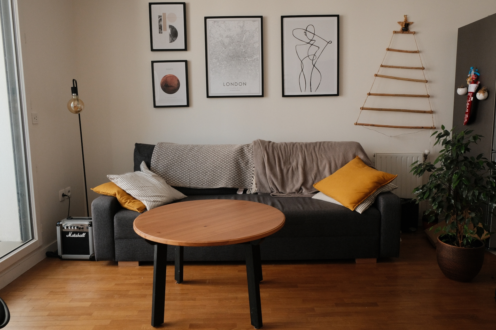

:::: {.columns}

::: {.column width="45%"}
{width="80%" fig-align="left"}
:::

::: {.column width="55%"}

## Home server 4To

Bienvenue sur la page principale du Dabrion Home Server. Le serveur est hébergé sur une Raspberry tournant sous Ubuntu-server 24.04 LTS.

Ce serveur privé possède une capacité de stockage actuelle de 4 To en RAID 1 [(synchronisé avec un serveur de secours hébergé sur une Raspberry tournant sous debian Bullseye)]{.light}.

:::

::::

:::: {.columns}

::: {.column width="55%"}

## Our services

### Cloud maison

Stockage de fichiers en sécurité sous la télé accessible ici: [Dabrion's Cloud](https://cloud.dabrion.eu)

### Nos petites recettes

 Les [recettes](receipes_list.qmd) que nous avons testées et approuvées ! 

:::

::: {.column width="45%"}

{width="70%" fig-align="left"}

:::

::::

