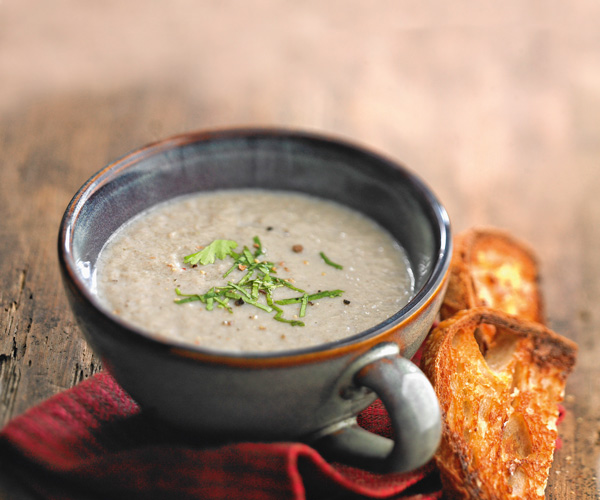

:::: {.columns}

::: {.column width="50%"}
# Ingredients (4 personnes)
* 1 oignon
* 500g de champignon de Paris
* 4 pommes de terre
* 20 cl de crème liquide
* sel, poivre, muscade

# Instructions
1. Faire revenir dans un peu de beurre les champignons et les pommes de terre avec l'oignon émincé
2. Faire suer les champignons
3. Mouiller un peu plus haut que le niveau des légumes et cuire 20 min
4. ajouter la crème et assaisonner 
 5. Mixer
:::

::: {.column width="50%"}

:::: {style='margin-top: 3em;'}
::::

{width="90%" fig-align="right"}

:::

::::
